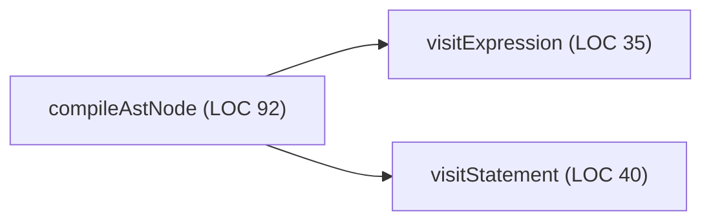

# High-focus technical formatting (`adhd-format`)

Dense engineering output -> fast human comprehension. Forge prose uses `social-text`,
which inherits BLUF, scannability, and progressive disclosure from this skill.

## Rules

1. **Lead with bottom line.** First sentence = decision, status, or required action. Cut
   filler preambles such as "Here is the report" and "Based on my analysis".
2. **Make scanning cheap.** Start every bullet with bold 2-4 word anchor or operative
   action. Keep paragraphs at 2-3 sentences. Use tables for multi-attribute comparison.
3. **Use alerts sparingly.** `> [!IMPORTANT]` = blocker or invariant;
   `> [!WARNING]` = deprecation or breaking risk; `> [!TIP]` = shortcut or command.
4. **Show state changes.** Sequence, state transition, or lattice explanation -> compact
   Mermaid diagram with <= 6 nodes.
5. **Disclose progressively.** Summary matrix first; actionable commands second; deep
   implementation detail linked or collapsed.

## Transformation pattern

### Weak

HISS-04 review found `compileAstNode` at cyclomatic 14 and 92 lines against limits 10 and
75. Refactor required.

### Focused

#### HISS-04 complexity infraction

| Function | Cyclomatic | Limit | Func LOC | Limit | Status |
| :--- | :--- | :--- | :--- | :--- | :--- |
| `compiler.compileAstNode` | **14** | <= 10 | **92** | <= 75 | blocked |

- **Extract node visits** into `visitExpression()` and `visitStatement()`.
- **Target complexity** <= 8.

