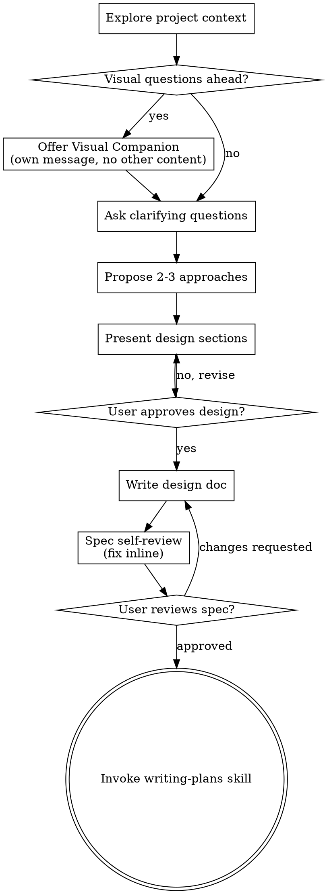

# Brainstorming Ideas Into Designs

Help turn ideas into fully formed designs and specs through natural collaborative dialogue.

Start by understanding current project context, then ask questions one at time to refine idea. Once you understand what you're building, present design and get user approval.

<HARD-GATE>
Do NOT invoke any implementation skill, write any code, scaffold any project, or take any implementation action until you have presented design and user has approved it. This applies to EVERY project regardless of perceived simplicity.
</HARD-GATE>

## Anti-Pattern: "This Is Too Simple To Need A Design"

Every project goes through this process. todo list, single-function utility, config change — all of them. "Simple" projects are where unexamined assumptions cause most wasted work. design can be short (few sentences for truly simple projects), but you MUST present it and get approval.

## Checklist

You MUST create task for each of these items and complete them in order:

1. **Explore project context** — check files, docs, recent commits
2. **Offer visual companion** (if topic will involve visual questions) — this is its own message, not combined with clarifying question. See Visual Companion section below.
3. **Ask clarifying questions** — one at time, understand purpose/constraints/success criteria
4. **Propose 2-3 approaches** — with trade-offs and your recommendation
5. **Present design** — in sections scaled to their complexity, get user approval after each section
6. **Write design doc** — save to `docs/superpowers/specs/YYYY-MM-DD-<topic>-design.md` and commit
7. **Spec self-review** — quick inline check for placeholders, contradictions, ambiguity, scope (see below)
8. **User reviews written spec** — ask user to review spec file before proceeding
9. **Transition to implementation** — invoke writing-plans skill to create implementation plan

## Process Flow

**terminal state is invoking writing-plans.** Do NOT invoke frontend-design, mcp-builder, or any other implementation skill. ONLY skill you invoke after brainstorming is writing-plans.

## The Process

**Understanding idea:**

- Check out current project state first (files, docs, recent commits)
- Before asking detailed questions, assess scope: if request describes multiple independent subsystems (e.g, "build a platform with chat, file storage, billing, and analytics"), flag this immediately. Don't spend questions refining details of project that needs to be decomposed first.
- If project is too large for single spec, help user decompose into sub-projects: what are independent pieces, how do they relate, what order should they be built? Then brainstorm first sub-project through normal design flow. Each sub-project gets its own spec → plan → implementation cycle.
- For appropriately-scoped projects, ask questions one at time to refine idea
- Prefer multiple choice questions when possible, but open-ended is fine too
- Only one question per message - if topic needs more exploration, break it into multiple questions
- Focus on understanding: purpose, constraints, success criteria

**Exploring approaches:**

- Propose 2-3 different approaches with trade-offs
- Present options conversationally with your recommendation and reasoning
- Lead with your recommended option and explain why

**Presenting design:**

- Once you believe you understand what you're building, present design
- Scale each section to its complexity: few sentences if straightforward, up to 200-300 words if nuanced
- Ask after each section whether it looks right so far
- Cover: architecture, components, data flow, error handling, testing
- Be ready to go back and clarify if something doesn't make sense

**Design for isolation and clarity:**

- Break system into smaller units that each have one clear purpose, communicate through well-defined interfaces, and can be understood and tested independently
- For each unit, you should be able to answer: what does it do, how do you use it, and what does it depend on?
- Can someone understand what unit does without reading its internals? Can you change internals without breaking consumers? If not, boundaries need work.
- Smaller, well-bounded units are easier to work with. You reason better about
  code held in context at once, and focused files make edits more reliable.
  Large files often signal mixed responsibilities.

**Working in existing codebases:**

- Explore current structure before proposing changes. Follow existing patterns.
- Include targeted improvements for problems affecting current work, such as
  oversized files, unclear boundaries, or tangled responsibilities.
- Don't propose unrelated refactoring. Stay focused on what serves current goal.

## After the Design

**Documentation:**

- Write validated design (spec) to `docs/superpowers/specs/YYYY-MM-DD-<topic>-design.md`
 - (User preferences for spec location override this default)
- Use elements-of-style:writing-clearly-and-concisely skill if available
- Commit design document to git

**Spec Self-Review:**
After writing spec document, look at it with fresh eyes:

1. **Placeholder scan:** Any "TBD", "TODO", incomplete sections, or vague requirements? Fix them.
2. **Internal consistency:** Do any sections contradict each other? Does architecture match feature descriptions?
3. **Scope check:** Is this focused enough for single implementation plan, or does it need decomposition?
4. **Ambiguity check:** Could any requirement be interpreted two different ways? If so, pick one and make it explicit.

Fix any issues inline. No need to re-review — fix and move on.

**User Review Gate:**
After spec review loop passes, ask user to review written spec before proceeding:

> "Spec written and committed to `<path>`. Please review it and let me know if you want to make any changes before we start writing out the implementation plan."

Wait for user's response. If they request changes, make them and re-run spec review loop. Only proceed once user approves.

**Implementation:**

- Invoke writing-plans skill to create detailed implementation plan
- Do NOT invoke any other skill. writing-plans is next step.

## Key Principles

- **One question at time** - Don't overwhelm with multiple questions
- **Multiple choice preferred** - Easier to answer than open-ended when possible
- **YAGNI ruthlessly** - Remove unnecessary features from all designs
- **Explore alternatives** - Always propose 2-3 approaches before settling
- **Incremental validation** - Present design, get approval before moving on
- **Be flexible** - Go back and clarify when something doesn't make sense

## Visual Companion

browser-based companion for showing mockups, diagrams, and visual options during brainstorming. Available as tool — not mode. Accepting companion means it's available for questions that benefit from visual treatment; it does NOT mean every question goes through browser.

**Offering companion:** When you anticipate that upcoming questions will involve visual content (mockups, layouts, diagrams), offer it once for consent:
> "Some of what we're working on might be easier to explain if I can show it to you in a web browser. I can put together mockups, diagrams, comparisons, and other visuals as we go. This feature is still new and can be token-intensive. Want to try it? (Requires opening a local URL)"

**This offer MUST be its own message.** Do not combine it with clarifying questions, context summaries, or any other content. message should contain ONLY offer above and nothing else. Wait for user's response before continuing. If they decline, proceed with text-only brainstorming.

**Per-question decision:** Even after user accepts, decide FOR EACH QUESTION whether to use browser or terminal. test: **would user understand this better by seeing it than reading it?**

- **Use browser** for content that IS visual — mockups, wireframes, layout comparisons, architecture diagrams, side-by-side visual designs
- **Use terminal** for content that is text — requirements questions, conceptual choices, tradeoff lists, /B/C/D text options, scope decisions

question about UI topic is not automatically visual question. "What does personality mean in this context?" is conceptual question — use terminal. "Which wizard layout works better?" is visual question — use browser.

If they agree to companion, read detailed guide before proceeding:
`skills/brainstorming/visual-companion.md`
