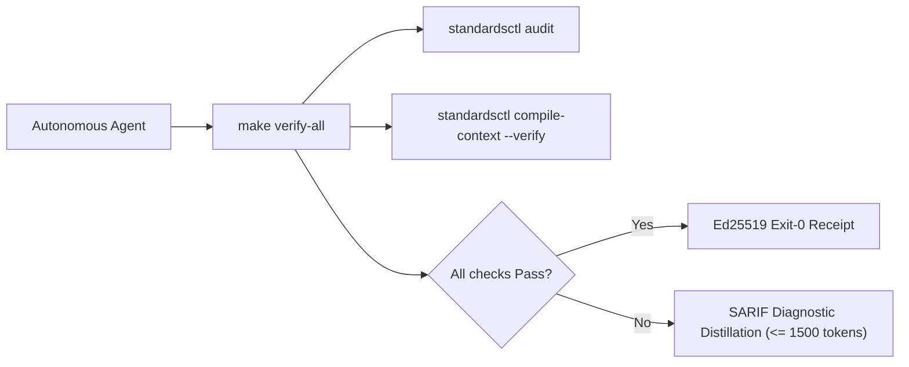

<!-- markdownlint-disable MD013 -->
<!-- Compiled automatically by standardsctl compile-context from AGENTS.md. DO NOT EDIT DIRECTLY. -->

<!--
SPDX-FileCopyrightText: 2026 lusoris <lusoris@pm.me>

SPDX-License-Identifier: CC-BY-SA-4.0
-->

<!-- markdownlint-disable MD013 MD025 -->
# golusoris Agent Operating Harness

Run verification before concluding any turn:

```bash
make verify-all
```



## Core Directives & Invariants — the praetor HISS-20 lattice (modernized NASA JPL Power-of-10)

Twenty invariants. The last column names the gate that actually runs **in this repository** — not praetor's generic gate. Where nothing runs here, the row says so.

| Invariant | Scope | NASA Rule | Rule | Gate in this repository |
| :--- | :--- | :--- | :--- | :--- |
| **HISS-01** | Control Flow | Rule 1 | Recursion strictly prohibited; call graph must be a DAG; zero `goto`. | `standardsctl audit` HISS scan (direct self-recursion + `goto`); mutual/indirect recursion is not decided |
| **HISS-02** | Loops & I/O | Rule 2 | Scalar upper bound on all loops; explicit `context.Context` timeout on all I/O. | `.golangci.yml` `noctx` / `contextcheck` / `fatcontext` / `containedctx`; `.semgrep.yml` `http-client-must-set-timeout` (semgrep job is advisory: `continue-on-error`) |
| **HISS-03** | Memory | Rule 3 | No steady-state heap churn in hot paths; preallocate and pool instead. | `b.ReportAllocs()` benchmarks in `core/id`, `core/crypto`, `cache/memory`; no repo-wide allocation gate runs them in CI — review-enforced |
| **HISS-04** | Complexity | Rule 4 | Cyclomatic $\le 10$, cognitive $\le 15$, function $\le 60$ LOC, $\le 50$ statements. | `.golangci.yml` `gocyclo` / `gocognit` / `funlen` + `standardsctl audit` (effective policy `max_func_loc=60`) |
| **HISS-05** | Scoping | Rule 6 | Declare every binding at its smallest lexical scope; no shadowing, no ad-hoc import aliases. | `.golangci.yml` `govet` with `enable-all` (includes `shadow`), plus `predeclared` and `importas` |
| **HISS-06** | Concurrency | — | Every goroutine fan-out carries an explicit upper bound (river `MaxWorkers`, semaphore channel). | CI `test` job `go test -race` + lefthook pre-push `build-test`; no static guard against an unbounded `go func` in a loop |
| **HISS-07** | Error Handling | Rule 7 | Every error handled or wrapped with context; no discarded returns. | `.golangci.yml` `errcheck` / `wrapcheck` / `errorlint` / `nilerr` via CI `lint` + lefthook pre-commit `golangci-lint` |
| **HISS-08** | Determinism | Rule 8 | No dynamic execution or dynamic code loading; no unsafe libc equivalents. | Zero `plugin.Open` / `reflect.MakeFunc` call sites in tree; `gosec` (blocking) and `.semgrep.yml` (advisory) run in CI, but no rule pins dynamic loading yet |
| **HISS-09** | Reference Safety | Rule 9 | Mandatory `// SAFETY:` proof for every `unsafe` block and pointer cast. | `gosec` G103 (`.gosec.json`, no exclusions, blocking in CI); zero `unsafe` imports in tree today; the proof text itself is review-enforced |
| **HISS-10** | Warning Hygiene | Rule 10 | Zero-warning tolerance across compiler, linter, and format sweeps. | CI `lint` job (`golangci-lint`, root + `core/`) and `go vet`; lefthook pre-commit `gofumpt` / `gci` / `govet` / `golangci-lint` |
| **HISS-11** | Supply Chain | — | Digest-pinned dependencies, SLSA 3 provenance, cosign signatures, SBOM per release. | Every workflow `uses:` is digest-pinned; `sbom.yml` (SPDX + CycloneDX attestations), `release.yml` (cosign keyless + SLSA), `verify-provenance.yml`, `scorecard.yml`, and the `.standards.lock` digest check in `standardsctl audit` |
| **HISS-12** | Secrets | — | Zero credentials in the working tree or in git history. | CI `gitleaks` job (full history, `.gitleaks.toml`, blocking) + lefthook pre-commit `gitleaks` |
| **HISS-13** | Debt Ratchet | — | Total infractions may never increase; the baseline only ratchets down. | `.standards-baseline.json` (0 today) enforced by `standardsctl audit` in lefthook pre-commit `hiss-audit`, pre-push `audit`, and `make verify-all` |
| **HISS-14** | Public ABI | — | Public contracts are append-only; a break carries a `Migration:` footer. | CI `apidiff` vs previous tag — **informational pre-1.0** (see the commented `-incompatible` gate in `ci.yml`); the `Migration:` footer is a PR-template checklist item, not an automated gate |
| **HISS-15** | 3D Testing | Rule 5 | Positive, negative, and boundary tests mandatory for all public interfaces. | CI `test` job: `go test -race` + 70% coverage threshold (85% on security-critical packages); the 3D shape itself is review-enforced |
| **HISS-16** | Context Integrity | Fleet | Single canonical `AGENTS.md`; vendor files compiled, never hand-edited; compiled target $< 300$ LOC. | `standardsctl compile-context --verify` in lefthook pre-commit `context-check` and `make verify-all` |
| **HISS-17** | State Ledger Discipline | Fleet | `.workingdir/` is the private, git-ignored live ledger: keep OPEN/BACKLOG/BUGS/QUESTIONS current via `standardsctl state task`, `state bug`, `state question`. | `standardsctl state sync .` in the lefthook post-commit hook |
| **HISS-18** | Diff-Aware CI Efficiency | Fleet | Run only the gates the diff touches; docs- and state-only changes skip the heavy suites. | **Not wired here** — `ci.yml` has no `standardsctl ci filter` step and no `paths:` filter, so every PR runs the full matrix |
| **HISS-19** | Reuse Before Writing | Fleet | One behavior, one implementation — extend or call what exists, configuration formats included. | `standardsctl dedupe scan .` (`make dedupe-scan`, part of `verify-all`) + lefthook post-commit `dedupe cadence --threshold=20` |
| **HISS-20** | Enforcement Coverage | Fleet | Every enforcement claim above is backed by a fixture corpus replayed in both directions. | **Not declared here** — there is no `.config/hiss/coverage.yaml`, so `standardsctl hiss coverage --verify` reports enforcement evidence undeclared for every invariant |

## Operational Rules

1. **Act on Verified State**:
   Read source files and run real commands before hypothesizing or editing. Never guess flag names, library signatures, or repo configurations from memory.

2. **Lead with Output**:
   Provide direct answers, diffs, and commands. Avoid filler preambles, "Based on", restatements, or conversational chatter.

3. **Context Transpiler First**:
   Never edit `CLAUDE.md`, `.cursor/rules/*.mdc`, `.windsurfrules`, or `.github/copilot-instructions.md` manually. Make all agent instruction updates in `AGENTS.md` and execute:

   ```bash
   standardsctl compile-context
   ```

4. **SARIF Diagnostic Distillation**:
   When reporting compiler or linter errors, distill output to $\le 1,500$ tokens ($< 60$ lines). Print the top 3 root-cause failures with file/line pointers and write full SARIF logs to ephemeral storage.

5. **No Evasion Tolerated**:
   Do not attempt `--no-verify`, `LEFTHOOK=0`, or modifying `.git/hooks`. All pull requests are authoritatively re-checked in an ephemeral isolated sandbox by `cordana-standards[bot]`.

6. **Anti-Loop Interception**:
   If the same AST diff and error category repeats $\ge 3$ times, halt execution immediately. Re-evaluate the underlying design instead of making micro-textual retries.

## Primary Verification Commands

`praetorctl` (alias `standardsctl`) ships as a prebuilt CLI and must be on `PATH` — this repo has no local `cmd/standardsctl` package to `go run`. lefthook already runs the governance checks below automatically (pre-commit `context-check` + `hiss-audit`, post-commit `state-sync`, pre-push `audit`); rerun them by hand after editing this file:

```bash
# Fast local test suite
go test -v -race ./...

# Regenerate vendor agent-context files after editing AGENTS.md, then verify
standardsctl compile-context
standardsctl compile-context --verify

# Audit repository against declared HISS invariants (Makefile alias: make audit)
standardsctl audit

# Run every formatting, linting, security, and governance gate (Makefile: make verify-all)
make verify-all
```

---

# Agent guide — golusoris

> Cross-tool context for [Claude Code](https://claude.com/claude-code), [Cursor](https://cursor.sh), [Aider](https://aider.chat), [Codex](https://github.com/openai/codex), [Continue](https://continue.dev), and other coding assistants.
> **Read this before suggesting changes.** Then read the per-subpackage `AGENTS.md` for the area you're touching.

## What this repo is

`golusoris` is a Go module (`github.com/golusoris/golusoris`) plus the lean `core/` sub-module (`github.com/golusoris/golusoris/core`, ADR-0017) that wraps a pinned set of best-in-class libraries behind opt-in `go.uber.org/fx` modules. Apps compose only what they need — nothing else ships. See [README.md](README.md) for the full module catalog and [docs/principles.md](docs/principles.md) for the complete coding contract.

## Hard rules

1. **Never break public API without a `Migration:` footer.** CI runs `apidiff` against the previous tag.
2. **Never add a transitive dependency** without weighing awesome-go alternatives. State the choice in the PR if non-obvious.
3. **Every subpackage exposes its capability as `fx.Module` or `fx.Options`.** Apps never import internals directly.
4. **No `init()` side effects.** All wiring goes through fx lifecycle hooks.
5. **All errors flow through `golusoris/core/errors`** (or `fmt.Errorf("pkg: op: %w", err)` — same convention).
6. **All time uses `golusoris/core/clock`.** `time.Now()` is banned outside the clock package.
7. **Logs go through the slog handler from `golusoris/core/log`.** No `fmt.Println`, no global loggers.
8. **Every merged commit: 0 lint · 0 gosec · 0 govulncheck · race-green.** `//nolint` requires a justification comment.

See [docs/principles.md](docs/principles.md) for the full Power-of-10, CERT, style, and compliance contract.

## Repository layout

See [README.md](README.md) for the full module catalog and directory layout, or run `tree -L 2 -I 'node_modules|.git'` for the live tree.

## Common tasks

| Task | Command / Skill |
|---|---|
| Add a new fx module | `/wire-fx-module` skill — see `.claude/skills/` |
| Add an ogen handler stub | `/scaffold-ogen-handler` skill |
| Add a river background worker | `/add-river-worker` skill |
| Add a DB migration | `/add-migration` skill |
| Bump golusoris in a downstream app | `/bump-golusoris` skill or `golusoris bump <version>` |

## Pinned upstream docs

Version-pinned snapshots live in `docs/upstream/`. Consult these before suggesting API patterns — public docs may be ahead or behind the pinned version.

| Package | Pinned version |
|---|---|
| `go.uber.org/fx` | v1.24.0 |
| `jackc/pgx/v5` | v5.11.0 |
| `ogen-go/ogen` | v1.24.0 |
| `riverqueue/river` | v0.47.0 |
| `knadh/koanf/v2` | v2.3.6 (`core/`) |

The full table (and the refresh recipe, `make docs-upstream`) is in [docs/upstream/README.md](docs/upstream/README.md).

## CI gates

Every PR must pass:

- `golangci-lint` (30+ linters — see `.golangci.yml`)
- `govulncheck`
- `go test -race -count=1` + 70% coverage (85% on security-critical packages)
- `apidiff` vs previous tag — no undeclared breaking changes
- Conventional-commit PR title

## When in doubt

Read [docs/principles.md](docs/principles.md) for the full coding contract, then read the per-subpackage `AGENTS.md` for the area you're touching.

## Claude Code

> Compiled into `CLAUDE.md` by `standardsctl compile-context` — edit here, never there.
> Claude Code loads `.claude/skills/*` and `.claude/hooks/*` on top of this section.

### Skills available

Skills: see `.claude/skills/` (auto-loaded; invoke via `/<skill-name>`).

### Hooks active

Hooks: see [`.claude/hooks/README.md`](.claude/hooks/README.md).

### Tone

- Be terse. No preamble.
- When changing public API: write the `Migration:` footer in the commit body, with before/after Go snippets.
- When adding a dependency: state which awesome-go alternatives you considered and why this one wins.

### Project principles — read [docs/principles.md](docs/principles.md) first

Read [docs/principles.md](docs/principles.md) — the Power-of-10/CERT/style/compliance contract — before any change. Day-to-day planning state lives separately in the private, git-ignored `.workingdir/` ledger (HISS-17); it never carries the coding contract itself.

### Working agreements (for AI agents)

- **Decisions go through `AskUserQuestion`.** Any clarifying question or multi-option choice uses the popup, never prose options — even binary ones. (#25)
- **State hygiene — record every bug fixed, confirmed, or ruled out immediately** via `praetorctl state bug resolve` (private, git-ignored `.workingdir/BUGS.md` ledger, HISS-17); don't batch to session end, or the next session re-investigates closed work. (#26)
- **Deep-dive deliverables.** A research/hardening PR ships the full set — per-module `AGENTS.md`, a decision/benchmark digest, and a STATE.md delta — not a config-only change. (#28)

### Don't

- Don't add features beyond what the task requires (per global Claude Code guidelines).
- Don't write multi-paragraph comments. One-liner WHY comments only.
- Don't create new markdown docs unless explicitly asked.

### Project state

- Session plan, status, and decision log live in the private, git-ignored `.workingdir/` ledger (HISS-17: `PLAN.md`, `STATE.md`, `BACKLOG.md`, `BUGS.md`, `QUESTIONS.md`) — never linked from tracked files, never staged (not even with `--force`).
- Fresh checkout: `praetorctl state init --if-absent` (preserves any ledger already present).
- After work: `praetorctl state sync .` — also runs automatically as the lefthook `post-commit` hook.

### Every commit: keep docs in sync

On each commit touching new/changed modules:

- Let `praetorctl state sync .` (lefthook `post-commit`) fold the commit into the private `.workingdir/STATE.md` session log.
- Update [README.md](README.md) "Landed so far" list when a step completes.
- Update [AGENTS.md](AGENTS.md) layout tree when adding new top-level packages.
- Write per-subpackage `AGENTS.md` for any new module.
