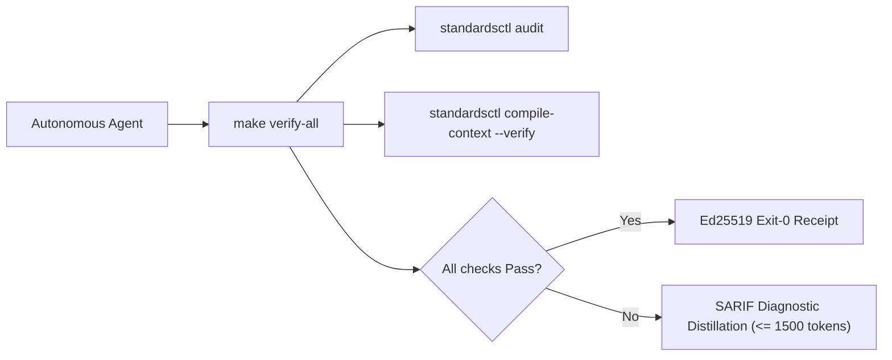

<!--
SPDX-FileCopyrightText: 2026 lusoris <lusoris@pm.me>

SPDX-License-Identifier: CC-BY-SA-4.0
-->

<!-- markdownlint-disable MD013 MD025 -->
# golusoris Agent Operating Harness

Run verification before concluding any turn:

```bash
make verify-all
```



## Core Directives & Invariants (Modernized NASA JPL Power-of-10)

| Invariant | Scope | NASA Rule | Enforcement Mechanism | Failure Action |
| :--- | :--- | :--- | :--- | :--- |
| **HISS-01** | Control Flow | Rule 1 | Recursion strictly prohibited; call graph must be DAG; zero `goto`. | Immediate build failure |
| **HISS-02** | Loops & I/O | Rule 2 | Scalar upper bound on all loops; explicit `context.Context` timeout on all I/O. | Semgrep / AST error |
| **HISS-03** | Memory | Rule 3 | Zero dynamic heap allocation (`malloc` / `free`) in hot simulation/tick loops. | Allocation audit sweep |
| **HISS-04** | Complexity | Rule 4 | Function length $\le 60$ LOC, McCabe Cyclomatic $\le 10$, Statements $\le 50$. | AST sweep blocker |
| **HISS-07** | Error Handling | Rule 7 | Zero `.unwrap()` / `.expect()`; all errors handled or wrapped with context. | Linter / Compiler error |
| **HISS-08** | Determinism | Rule 8 | Zero dynamic execution (`eval` / `exec`); zero banned unsafe libc (`gets` / `strcpy` / `sprintf`). | AST / Linter error |
| **HISS-09** | Reference Safety | Rule 9 | Mandatory `// SAFETY:` proofs for all pointer arithmetic and `unsafe` blocks. | AST check blocker |
| **HISS-10** | Warning Hygiene | Rule 10 | Zero-warning tolerance across compiler, linter, and format sweeps. | Exit code 1 |
| **HISS-15** | 3D Testing | Rule 5 | Positive, negative, and boundary tests mandatory for all public interfaces. | CI coverage gate |
| **HISS-16** | Context Integrity | Fleet | Single canonical `AGENTS.md`; vendor files compiled via `standardsctl compile-context`. | Pre-commit blocker |

## Operational Rules

1. **Act on Verified State**:
   Read source files and run real commands before hypothesizing or editing. Never guess flag names, library signatures, or repo configurations from memory.

2. **Lead with Output**:
   Provide direct answers, diffs, and commands. Avoid filler preambles, "Based on", restatements, or conversational chatter.

3. **Context Transpiler First**:
   Never edit `CLAUDE.md`, `.cursor/rules/*.mdc`, `.windsurfrules`, or `.github/copilot-instructions.md` manually. Make all agent instruction updates in `AGENTS.md` and execute:

   ```bash
   standardsctl compile-context
   ```

4. **SARIF Diagnostic Distillation**:
   When reporting compiler or linter errors, distill output to $\le 1,500$ tokens ($< 60$ lines). Print the top 3 root-cause failures with file/line pointers and write full SARIF logs to ephemeral storage.

5. **No Evasion Tolerated**:
   Do not attempt `--no-verify`, `LEFTHOOK=0`, or modifying `.git/hooks`. All pull requests are authoritatively re-checked in an ephemeral isolated sandbox by `cordana-standards[bot]`.

6. **Anti-Loop Interception**:
   If the same AST diff and error category repeats $\ge 3$ times, halt execution immediately. Re-evaluate the underlying design instead of making micro-textual retries.

## Primary Verification Commands

```bash
# Fast local test suite
go test -v -race ./...

# Recompile and verify cross-agent context outputs
standardsctl compile-context --verify

# Audit repository against declared HISS-16 standards
standardsctl audit

# Run all formatting, linting, and security gates
make verify-all
```

---

# Agent guide — golusoris

> Cross-tool context for [Claude Code](https://claude.com/claude-code), [Cursor](https://cursor.sh), [Aider](https://aider.chat), [Codex](https://github.com/openai/codex), [Continue](https://continue.dev), and other coding assistants.
> **Read this before suggesting changes.** Then read the per-subpackage `AGENTS.md` for the area you're touching.

## What this repo is

`golusoris` is a Go module (`github.com/golusoris/golusoris`) plus the lean `core/` sub-module (`github.com/golusoris/golusoris/core`, ADR-0017) that wraps a pinned set of best-in-class libraries behind opt-in `go.uber.org/fx` modules. Apps compose only what they need — nothing else ships. See [README.md](README.md) for the full module catalog and [docs/principles.md](docs/principles.md) for the complete coding contract.

## Hard rules

1. **Never break public API without a `Migration:` footer.** CI runs `apidiff` against the previous tag.
2. **Never add a transitive dependency** without weighing awesome-go alternatives. State the choice in the PR if non-obvious.
3. **Every subpackage exposes its capability as `fx.Module` or `fx.Options`.** Apps never import internals directly.
4. **No `init()` side effects.** All wiring goes through fx lifecycle hooks.
5. **All errors flow through `golusoris/core/errors`** (or `fmt.Errorf("pkg: op: %w", err)` — same convention).
6. **All time uses `golusoris/core/clock`.** `time.Now()` is banned outside the clock package.
7. **Logs go through the slog handler from `golusoris/core/log`.** No `fmt.Println`, no global loggers.
8. **Every merged commit: 0 lint · 0 gosec · 0 govulncheck · race-green.** `//nolint` requires a justification comment.

See [docs/principles.md](docs/principles.md) for the full Power-of-10, CERT, style, and compliance contract.

## Repository layout

```
golusoris/
├── golusoris.go              # top-level fx.Module re-exports (Core, DB, HTTP, …)
├── capabilities.yaml         # machine-readable capability contract (praetor `needs` reads it)
├── lefthook.yml              # git-hook gate (pre-commit / commit-msg / pre-push) — scripts in scripts/hooks/
│
├── core/                     # LEAN SUB-MODULE (own go.mod) — github.com/golusoris/golusoris/core
│   ├── config/               # koanf v2: env + file + YAML + file-watch
│   ├── codec/yaml/           # fleet YAML codec — strict · bounded · atomic writes
│   ├── log/                  # slog factory: tint(dev)/JSON(prod) + OTel bridge
│   ├── errors/               # typed errors + stack traces + ogen-status mapping
│   ├── crypto/               # argon2id · AES-GCM · sealed secrets · column encryption
│   │   └── receipt/          # Ed25519 Exit-0 execution receipts
│   ├── clock/                # mockable Clock (real + fake) — time.Now() ban
│   ├── id/                   # UUIDv7 · KSUID · snowflake generators
│   ├── validate/             # go-playground/validator wrapper
│   ├── version/              # build metadata (ldflags / VCS)
│   ├── clikit/               # cobra + fx-aware CLI app builder
│   ├── mcp/                  # MCP server fx module (stdio + streamable-HTTP)
│   ├── gitx/                 # bounded git runner
│   │   └── worktree/         # per-task git worktrees
│   ├── astx/                 # source walker · AST import rewriter · func metrics · go.mod
│   └── capabilities/         # schema + loader for capabilities.yaml
│
├── i18n/                     # locale negotiation middleware + message catalog
│
├── db/
│   ├── pgx/                  # pgx pool fx module + startup retry + slow-query logger
│   ├── migrate/              # golang-migrate v4 runner + fx hook
│   ├── sqlc/                 # shared sqlc.yaml fragment + query helpers
│   ├── sqlite/               # embedded SQLite (modernc, pure Go) fx module
│   ├── bun/                  # uptrace/bun ORM over the db/pgx pool (opt-in)
│   ├── geo/                  # PostGIS pgx types — Point, BBox, EWKB, Haversine
│   ├── timescale/            # TimescaleDB hypertable + retention + compression
│   ├── clickhouse/           # ClickHouse OLAP fx module
│   └── cdc/                  # pglogrepl WAL consumer → typed Event
│
├── httpx/
│   ├── server/               # *http.Server + slow-loris + body limits + graceful stop
│   ├── router/               # chi router → chi.Router + http.Handler in fx
│   ├── middleware/           # logger · recovery · requestid · OTel · secure-headers
│   ├── client/               # retry + circuit-breaker + OTel HTTP client
│   ├── cors/                 # rs/cors middleware
│   ├── csrf/                 # gorilla/csrf middleware
│   ├── ratelimit/            # per-IP/per-user rate limiting (ulule/limiter)
│   ├── ws/                   # WebSocket fan-out helpers
│   ├── form/                 # HTML form → struct decoder
│   ├── static/               # static files + ETag + cache headers
│   │   └── hashfs/           # hashed-asset embed FS + gzip/brotli
│   ├── vite/                 # Vite manifest reader
│   ├── htmx/                 # HX-* response header helpers
│   ├── autotls/              # autocert + certmagic (pluggable TLS)
│   ├── geofence/             # IP/country allow-deny middleware
│   └── rangeserve/           # HTTP range-request serving
│
├── ogenkit/                  # ogen server adapter + RFC 9457 error mapper
├── apidocs/                  # Scalar UI (/docs) + MCP-from-OpenAPI (/mcp)
│
├── otel/                     # full OTel SDK (tracer + meter + logs + OTLP)
├── observability/
│   ├── sentry/               # Sentry fx module (slog + OTel bridged)
│   ├── profiling/            # Pyroscope in-process + eBPF mode
│   ├── pprof/                # auth-gated /debug/pprof endpoint
│   └── statuspage/           # /status page — uptime + dependency health
│
├── k8s/
│   ├── podinfo/              # downward-API env → PodInfo
│   ├── health/               # /livez /readyz /startupz
│   ├── metrics/prom/         # Prometheus /metrics + check-status gauges
│   ├── client/               # client-go + workload identity (GKE/EKS/Azure)
│   └── operator/             # controller-runtime manager + CRD/reconciler scaffold
│
├── container/runtime/        # detect runtime (k8s/docker/podman/systemd/bare)
├── leader/                   # pluggable leader-election
│   ├── k8s/                  # Kubernetes Lease backend
│   └── pg/                   # PostgreSQL advisory-lock backend
├── systemd/                  # sd_notify + watchdog
│
├── jobs/                     # river client + worker registry + periodic helpers
│   ├── cron/                 # cron expression parser/validator
│   ├── ui/                   # river-ui admin dashboard mount
│   └── workflow/             # Temporal orchestration fx module
│
├── outbox/                   # transactional outbox → river dispatcher
│   └── cdc/                  # CDC-based drain → Kafka/NATS/webhook sinks
│
├── cache/
│   ├── memory/               # otter v2 typed in-memory cache
│   ├── redis/                # rueidis fx module + distributed locks
│   └── singleflight/         # typed de-dupe wrapper
│
├── auth/
│   ├── oidc/                 # OIDC + PKCE + session storage
│   ├── passkeys/             # WebAuthn + TOTP (MFA)
│   ├── jwt/                  # JWT issuance + validation + rotation
│   ├── apikey/               # API key issuance + rotation + scopes
│   ├── magiclink/            # passwordless email-link sign-in
│   ├── linking/              # multi-IdP identity linking
│   ├── impersonate/          # audited admin impersonation
│   ├── session/              # server-side session + revoke UI
│   ├── recovery/             # recovery codes + forgot-password flow
│   ├── policy/               # zxcvbn password strength + HIBP breach check
│   ├── lockout/              # per-identity brute-force lockout
│   ├── oauth2server/         # OAuth 2.1 IdP (fosite)
│   ├── scim/                 # SCIM 2.0 user + group provisioning
│   └── captcha/              # Turnstile + hCaptcha + reCAPTCHA verifiers
├── authz/                    # Casbin RBAC/ABAC
│
├── notify/                   # unified Sender + Notifier + SMTP
│   ├── resend/  postmark/  sendgrid/  mailgun/  ses/   # email senders
│   ├── twilio/  fcm/  apns2/  webpush/  telegram/  teams/  discord/  slack/
│   ├── unsub/               # RFC 8058 one-click unsubscribe
│   └── bounce/              # SES/Postmark bounce + complaint handlers
│
├── realtime/
│   ├── sse/                 # Server-Sent Events hub
│   └── pubsub/              # pub/sub — pg LISTEN/NOTIFY + redis + NATS
│
├── webhooks/
│   ├── in/                  # inbound signature verification
│   └── out/                 # outbound delivery + retry + dead-letter
│
├── tenancy/                 # tenant context middleware + extractors
├── idempotency/             # Idempotency-Key middleware
├── flags/                   # OpenFeature flags + postgres provider
├── audit/                   # append-only audit event log
├── page/                    # typed cursor + offset pagination
│
├── storage/                 # Bucket interface + local backend
│   ├── presign/             # S3 direct-browser upload helpers
│   ├── tus/                 # resumable uploads (tus)
│   ├── safety/              # EXIF strip + SSRF + path-traversal guards
│   └── scan/                # ClamAV malware scan
├── archive/                 # zip/tar/rar/7z/brotli/zstd extract + create
├── media/
│   ├── av/                  # FFmpeg probe + transcode (CGO sub-module)
│   ├── img/                 # image resize + format (CGO sub-module)
│   │   └── pipeline/        # on-demand resize + HMAC signed-URL serving
│   ├── cv/                  # face/object detection + thumbnails (CGO sub-module)
│   ├── audio/               # audio decode/encode/analyse
│   ├── game/                # Ebitengine 2D game scaffold (own go.mod)
│   └── 3d/                  # g3n 3D engine scaffold (own go.mod)
├── ocr/                     # OCR text extraction (CGO sub-module, own go.mod)
├── pdf/                     # HTML → PDF (chromedp)
│   └── parse/               # PDF metadata + validate + merge (pdfcpu)
├── docs/
│   ├── xlsx/                # XLSX read + write (excelize)
│   ├── docx/                # DOCX template substitution
│   └── epub/                # EPUB 3.0 generator
├── markdown/                # Markdown → HTML (goldmark GFM)
├── htmltmpl/                # type-safe HTML templates (templ)
├── jsonschema/              # JSON Schema 2020-12 validation
├── hash/                    # SHA-256, BLAKE3, xxhash-64, ETag helpers
├── fs/watch/                # recursive dir watch with debounce
├── httpx/rangeserve/        # HTTP range serving for video/large files
├── torrent/                 # Client interface + rtorrent/qBittorrent/transmission backends
│
├── search/                  # Indexer/Searcher interface + MemorySearcher
├── ai/
│   ├── llm/                 # unified Chat/Stream/Embed (Anthropic + OpenAI + Ollama)
│   └── vector/              # pgvector schema + similarity + hybrid search
│
├── payments/
│   ├── stripe/              # Stripe Checkout + Portal + Payment Intents
│   ├── subs/                # subscription state machine
│   ├── meter/               # usage metering
│   └── invoice/             # PDF invoicing
├── money/                   # currency-aware Money type (ISO 4217)
│
├── geoip/                   # MaxMind GeoLite2 country/city/ASN lookups
├── secrets/                 # Secret interface + env/file/static backends
├── integrations/goenvoy/    # fx adapter for github.com/golusoris/goenvoy
│
├── grpc/                    # gRPC server + ConnFactory (OTel + slog + recovery)
├── graphql/                 # gqlgen server (APQ, complexity, GraphiQL)
│   └── client/              # genqlient typed GraphQL client
├── pubsub/
│   ├── kafka/               # franz-go Kafka producer + consumer
│   └── nats/                # NATS JetStream
├── net/
│   ├── wol/                 # Wake-on-LAN magic-packet sender (stdlib)
│   ├── dnsserver/           # DNS server — UDP + TCP (miekg/dns)
│   └── smtpserver/          # Inbound SMTP server (emersion/go-smtp)
├── ebpf/                    # cilium/ebpf scaffold (ObjectProvider + Registry)
│
├── science/
│   ├── numerical/           # gonum linear algebra + stats (own go.mod)
│   ├── plot/                # gonum/plot chart rendering (own go.mod)
│   └── bio/                 # bioinformatics — FASTA, rev-comp (own go.mod)
├── web3/
│   ├── evm/                 # Ethereum/EVM client + key gen (own go.mod)
│   └── solana/              # Solana RPC + keypair (own go.mod)
├── hw/
│   ├── gpio/                # GPIO/I²C/SPI via periph.io (own go.mod)
│   ├── robotics/            # gobot scaffold (own go.mod)
│   ├── udev/                # Linux udev events (own go.mod)
│   └── fssnap/              # ZFS + Btrfs snapshot CLI wrappers (own go.mod)
│
├── clikit/tui/              # bubbletea Run/RunInline helpers (clikit itself is in core/)
├── selfupdate/              # binary self-update from GitHub releases
├── plugin/                  # generic thread-safe Registry[T]
│
├── testutil/
│   ├── pg/                  # testcontainers PostgreSQL
│   ├── redis/               # testcontainers Redis
│   ├── river/               # in-process river test harness
│   ├── fxtest/              # fx lifecycle helpers for tests
│   ├── snapshot/            # golden-file / snapshot testing
│   ├── factory/             # deterministic gofakeit test data factories
│   ├── fuzz/                # fuzz corpus directory helpers
│   ├── load/                # vegeta load-test harness
│   ├── mutation/            # go-mutesting runner + score assertion
│   ├── prop/                # gopter property-based testing (own go.mod)
│   └── pact/                # Pact contract testing (own go.mod)
│
├── cmd/
│   ├── golusoris/           # scaffolder CLI (init / add / bump + codemods)
│   └── golusoris-mcp/       # MCP JSON-RPC server
│
├── deploy/
│   ├── helm/                # base Helm chart
│   ├── observability/       # PrometheusRule + Grafana dashboard
│   ├── logging/             # Loki + Promtail config
│   ├── terraform/           # Terraform modules (VPC/RDS/ElastiCache/S3/IAM)
│   ├── flux/                # Flux GitOps manifests
│   ├── argocd/              # Argo CD Application manifests
│   └── crossplane/          # XRD + Composition + claim example
│
├── tools/                   # golangci.yml, sqlc.yaml.fragment, Makefile helpers
├── scripts/                 # hooks/ (lefthook checks), changelog/ (fragment renderer), ci/
├── template/
│   ├── .github/             # per-app CI + release workflow stubs, dependabot
│   └── .devcontainer/       # Go + Postgres + Redis + NATS devcontainer
│
├── docs/
│   ├── principles.md        # full coding + security + compliance contract (§2)
│   ├── adr/                 # Architecture Decision Records (Nygard format)
│   ├── architecture/        # C4 PlantUML diagrams (Context + Container)
│   ├── migrations/          # per-version API migration guides
│   └── upstream/            # pinned upstream docs snapshots
│
├── examples/
│   ├── minimal/             # Core + DB + OTel + HTTP + K8s health
│   └── full/                # all major modules composed
│
└── AGENTS.md  CLAUDE.md     # this file + Claude-specific instructions
```

Per-subpackage `AGENTS.md` files give package-level conventions, idioms, and pinned doc URLs.

## Common tasks

| Task | Command / Skill |
|---|---|
| Add a new fx module | `/wire-fx-module` skill — see `.claude/skills/` |
| Add an ogen handler stub | `/scaffold-ogen-handler` skill |
| Add a river background worker | `/add-river-worker` skill |
| Add a DB migration | `/add-migration` skill |
| Bump golusoris in a downstream app | `/bump-golusoris` skill or `golusoris bump <version>` |

## Pinned upstream docs

Version-pinned snapshots live in `docs/upstream/`. Consult these before suggesting API patterns — public docs may be ahead or behind the pinned version.

| Package | Pinned version |
|---|---|
| `go.uber.org/fx` | v1.24.0 |
| `jackc/pgx/v5` | v5.11.0 |
| `ogen-go/ogen` | v1.24.0 |
| `riverqueue/river` | v0.47.0 |
| `knadh/koanf/v2` | v2.3.6 (`core/`) |

The full table (and the refresh recipe, `make docs-upstream`) is in [docs/upstream/README.md](docs/upstream/README.md).

## CI gates

Every PR must pass:

- `golangci-lint` (30+ linters — see `tools/golangci.yml`), `gosec`
- `govulncheck`
- `go test -race -count=1` + 70% coverage (85% on security-critical packages) — root and `core/`
- `apidiff` vs previous tag — no undeclared breaking changes
- Semgrep custom SAST, gitleaks secret scan, dependency review
- DCO `Signed-off-by:` on every commit, `reuse lint` (SPDX / REUSE)
- Changelog fragments (`scripts/changelog/render.sh --check`)
- Conventional-commit PR title
- praetor `standardsctl audit` + `compile-context --verify` via `make verify-all`

## When in doubt

Read [docs/principles.md](docs/principles.md) for the full coding contract, then read the per-subpackage `AGENTS.md` for the area you're touching.

## Claude Code

> Compiled into `CLAUDE.md` by `standardsctl compile-context` — edit here, never there.
> Claude Code loads `.claude/skills/*` and `.claude/hooks/*` on top of this section.

### Skills available

Located in `.claude/skills/`:

| Skill | When to use |
|---|---|
| `wire-fx-module` | Adding a new opt-in fx module to the framework |
| `scaffold-ogen-handler` | Generating an ogen handler stub from an operationId |
| `add-river-worker` | Adding a river job worker (registered in fx) |
| `add-migration` | Creating a timestamped golang-migrate up/down pair |
| `bump-golusoris` | Bumping golusoris in a downstream app + applying codemods from migration notes |

Invoke via `/<skill-name>` in Claude Code.

### Hooks active

Located in `.claude/hooks/`:

- Touching `**/jobs/*.go` auto-loads `docs/upstream/river/` + `jobs/AGENTS.md`
- Touching `**/migrations/*.sql` auto-loads `docs/upstream/golang-migrate/` + the project's existing migrations summary
- Touching `**/api/*.go` (ogen) auto-loads `docs/upstream/ogen/` + the OpenAPI spec
- Git hooks (`lefthook.yml`, scripts in `scripts/hooks/`; install with `lefthook install`): pre-commit runs gofumpt / gci / golangci-lint / go vet on the staged packages plus `standardsctl compile-context --verify`, `reuse lint`, `gitleaks`; commit-msg checks Conventional Commits + `Signed-off-by:` (DCO); pre-push runs `go build` + `go test -short` in root and `core/`. Absent tools skip with a message — `make verify-all` / CI stays authoritative.

### Tone

- Be terse. No preamble.
- When changing public API: write the `Migration:` footer in the commit body, with before/after Go snippets.
- When adding a dependency: state which awesome-go alternatives you considered and why this one wins.
- Never add init() side effects. Always use fx lifecycle.

### Project principles — read [.workingdir/PLAN.md §2](.workingdir/PLAN.md) first

§2 is the framework's foundational contract. Quick hitlist for AI agents:

- **§2.1 Power of 10, Go-adapted** — hard gates on rules 1, 2, 4, 7, 10 (control flow, bounded loops, function size, error wrapping, zero lint/gosec/vuln). Guidance on 3, 5, 6, 9.
- **§2.2 SEI CERT for Go** — security rules (crypto, input validation, concurrency). Cite rule IDs in review.
- **§2.3 Google Go Style Guide** — canonical style. Effective Go + Code Review Comments secondary.
- **§2.4 C4 + ADRs** — architecture decisions in `docs/adr/`, one per decision, Nygard format.
- **§2.5 Security + supply-chain standards** — SLSA L3, OWASP ASVS L2, NIST SSDF, EU CRA, NIS2, BSI IT-Grundschutz, BSI C5, UK NCSC, ENISA, GDPR, EU AI Act. Framework ships scaffolding; apps assert compliance in `SECURITY.md`.
- **§2.6 Wire protocols** — RFC 9457 Problem Details (error body), OpenAPI 3.1, OTel SemConv v1.26, JWT/OAuth/PKCE/WebAuthn.
- **§2.7 Tooling + formatting** — EditorConfig, gofumpt, gci, golines, Conventional Commits, SemVer, Keep-a-Changelog, Trunk-Based Dev.
- **§2.8 Testing** — table-driven tests, `go test -race`, integration over mocks, fuzz + property-based opt-in, 70% coverage (85% on security-critical pkgs).
- **§2.9 Deployment** — Twelve-Factor, CNCF cloud-native, OCI, rootless + read-only FS.

Every merged commit: 0 lint · 0 gosec · 0 govulncheck · race-green. `//nolint` needs a justification comment.

### Working agreements (for AI agents)

- **Decisions go through `AskUserQuestion`.** Any clarifying question or multi-option choice uses the popup, never prose options — even binary ones. (#25)
- **State hygiene — update [.workingdir/STATE.md](.workingdir/STATE.md) immediately** after each bug is fixed, confirmed, or ruled out; don't batch to session end, or the next session re-investigates closed work. (#26)
- **Deep-dive deliverables.** A research/hardening PR ships the full set — per-module `AGENTS.md`, a decision/benchmark digest, and a STATE.md delta — not a config-only change. (#28)

### Don't

- Don't use `time.Now()` outside `core/clock/`. Use `clock.Now(ctx)`.
- Don't `fmt.Println` — use the slog handler from `core/log/`.
- Don't add features beyond what the task requires (per global Claude Code guidelines).
- Don't write multi-paragraph comments. One-liner WHY comments only.
- Don't create new markdown docs unless explicitly asked.
- Don't silence a linter without adding a justification comment next to the `//nolint` directive.

### Project state

- Pre-1.0. Latest tag `v0.8.0`; `v0.9.0` in preparation — lean `core/` sub-module (ADR-0017), EUPL-1.2 relicense (ADR-0018), praetor HISS-16 governance (ADR-0019), Go 1.27 floor. Every module in the README catalog is landed and gated by CI.
- See [.workingdir/PLAN.md](.workingdir/PLAN.md) for the plan + decisions log, [.workingdir/STATE.md](.workingdir/STATE.md) for the session log (older entries in `.workingdir/archive/`), [.workingdir/TODO.md](.workingdir/TODO.md) for open work, and [docs/migrations/v0.9.0.md](docs/migrations/v0.9.0.md) for the import-path move.

### Every commit: keep docs in sync

On each commit touching new/changed modules:

- Update [.workingdir/STATE.md](.workingdir/STATE.md) session log with the commit summary.
- Update the [README.md](README.md) module catalog (and `capabilities.yaml`) when a package is added or moved.
- Update [AGENTS.md](AGENTS.md) layout tree when adding new top-level packages.
- Write per-subpackage `AGENTS.md` for any new module.
