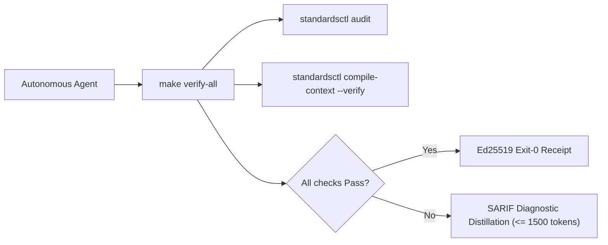

<!--
SPDX-FileCopyrightText: 2026 lusoris <lusoris@pm.me>

SPDX-License-Identifier: CC-BY-SA-4.0
-->

<!-- markdownlint-disable MD013 MD025 -->
# golusoris Agent Operating Harness

Run verification before concluding any turn:

```bash
make verify-all
```



## Core Directives & Invariants (Modernized NASA JPL Power-of-10)

| Invariant | Scope | NASA Rule | Enforcement Mechanism | Failure Action |
| :--- | :--- | :--- | :--- | :--- |
| **HISS-01** | Control Flow | Rule 1 | Recursion strictly prohibited; call graph must be DAG; zero `goto`. | Immediate build failure |
| **HISS-02** | Loops & I/O | Rule 2 | Scalar upper bound on all loops; explicit `context.Context` timeout on all I/O. | Semgrep / AST error |
| **HISS-03** | Memory | Rule 3 | Zero dynamic heap allocation (`malloc` / `free`) in hot simulation/tick loops. | Allocation audit sweep |
| **HISS-04** | Complexity | Rule 4 | Function length $\le 60$ LOC, McCabe Cyclomatic $\le 10$, Statements $\le 50$. | AST sweep blocker |
| **HISS-07** | Error Handling | Rule 7 | Zero `.unwrap()` / `.expect()`; all errors handled or wrapped with context. | Linter / Compiler error |
| **HISS-08** | Determinism | Rule 8 | Zero dynamic execution (`eval` / `exec`); zero banned unsafe libc (`gets` / `strcpy` / `sprintf`). | AST / Linter error |
| **HISS-09** | Reference Safety | Rule 9 | Mandatory `// SAFETY:` proofs for all pointer arithmetic and `unsafe` blocks. | AST check blocker |
| **HISS-10** | Warning Hygiene | Rule 10 | Zero-warning tolerance across compiler, linter, and format sweeps. | Exit code 1 |
| **HISS-15** | 3D Testing | Rule 5 | Positive, negative, and boundary tests mandatory for all public interfaces. | CI coverage gate |
| **HISS-16** | Context Integrity | Fleet | Single canonical `AGENTS.md`; vendor files compiled via `standardsctl compile-context`. | Pre-commit blocker |
| **HISS-17** | State Ledger Discipline | Fleet | `.workingdir/` is the live ledger: keep OPEN/BACKLOG/BUGS/QUESTIONS current via `standardsctl state task`, `state bug`, `state question`. | `standardsctl state sync --verify` |
| **HISS-18** | Diff-Aware CI Efficiency | Fleet | Run only the gates the diff touches; docs- and state-only changes skip the heavy suites. | `standardsctl ci filter` |
| **HISS-19** | Reuse Before Writing | Fleet | One behavior, one implementation — extend or call what exists, configuration formats included. | `standardsctl dedupe scan` |

## Operational Rules

1. **Act on Verified State**:
   Read source files and run real commands before hypothesizing or editing. Never guess flag names, library signatures, or repo configurations from memory.

2. **Lead with Output**:
   Provide direct answers, diffs, and commands. Avoid filler preambles, "Based on", restatements, or conversational chatter.

3. **Context Transpiler First**:
   Never edit `CLAUDE.md`, `.cursor/rules/*.mdc`, `.windsurfrules`, or `.github/copilot-instructions.md` manually. Make all agent instruction updates in `AGENTS.md` and execute:

   ```bash
   standardsctl compile-context
   ```

4. **SARIF Diagnostic Distillation**:
   When reporting compiler or linter errors, distill output to $\le 1,500$ tokens ($< 60$ lines). Print the top 3 root-cause failures with file/line pointers and write full SARIF logs to ephemeral storage.

5. **No Evasion Tolerated**:
   Do not attempt `--no-verify`, `LEFTHOOK=0`, or modifying `.git/hooks`. All pull requests are authoritatively re-checked in an ephemeral isolated sandbox by `cordana-standards[bot]`.

6. **Anti-Loop Interception**:
   If the same AST diff and error category repeats $\ge 3$ times, halt execution immediately. Re-evaluate the underlying design instead of making micro-textual retries.

## Primary Verification Commands

```bash
# Fast local test suite
go test -v -race ./...

# Recompile and verify cross-agent context outputs
standardsctl compile-context --verify

# Audit repository against declared HISS-16 standards
standardsctl audit

# Run all formatting, linting, and security gates
make verify-all
```

---

# Agent guide — golusoris

> Cross-tool context for [Claude Code](https://claude.com/claude-code), [Cursor](https://cursor.sh), [Aider](https://aider.chat), [Codex](https://github.com/openai/codex), [Continue](https://continue.dev), and other coding assistants.
> **Read this before suggesting changes.** Then read the per-subpackage `AGENTS.md` for the area you're touching.

## What this repo is

`golusoris` is a Go module (`github.com/golusoris/golusoris`) plus the lean `core/` sub-module (`github.com/golusoris/golusoris/core`, ADR-0017) that wraps a pinned set of best-in-class libraries behind opt-in `go.uber.org/fx` modules. Apps compose only what they need — nothing else ships. See [README.md](README.md) for the full module catalog and [docs/principles.md](docs/principles.md) for the complete coding contract.

## Hard rules

1. **Never break public API without a `Migration:` footer.** CI runs `apidiff` against the previous tag.
2. **Never add a transitive dependency** without weighing awesome-go alternatives. State the choice in the PR if non-obvious.
3. **Every subpackage exposes its capability as `fx.Module` or `fx.Options`.** Apps never import internals directly.
4. **No `init()` side effects.** All wiring goes through fx lifecycle hooks.
5. **All errors flow through `golusoris/core/errors`** (or `fmt.Errorf("pkg: op: %w", err)` — same convention).
6. **All time uses `golusoris/core/clock`.** `time.Now()` is banned outside the clock package.
7. **Logs go through the slog handler from `golusoris/core/log`.** No `fmt.Println`, no global loggers.
8. **Every merged commit: 0 lint · 0 gosec · 0 govulncheck · race-green.** `//nolint` requires a justification comment.

See [docs/principles.md](docs/principles.md) for the full Power-of-10, CERT, style, and compliance contract.

## Repository layout

See [README.md](README.md) for the full module catalog and directory layout, or run `tree -L 2 -I 'node_modules|.git'` for the live tree.

## Common tasks

| Task | Command / Skill |
|---|---|
| Add a new fx module | `/wire-fx-module` skill — see `.claude/skills/` |
| Add an ogen handler stub | `/scaffold-ogen-handler` skill |
| Add a river background worker | `/add-river-worker` skill |
| Add a DB migration | `/add-migration` skill |
| Bump golusoris in a downstream app | `/bump-golusoris` skill or `golusoris bump <version>` |

## Pinned upstream docs

Version-pinned snapshots live in `docs/upstream/`. Consult these before suggesting API patterns — public docs may be ahead or behind the pinned version.

| Package | Pinned version |
|---|---|
| `go.uber.org/fx` | v1.24.0 |
| `jackc/pgx/v5` | v5.9.1 |
| `ogen-go/ogen` | v1.20.3 |
| `riverqueue/river` | v0.34.0 |
| `knadh/koanf/v2` | v2.3.4 |

## CI gates

Every PR must pass:

- `golangci-lint` (30+ linters — see `tools/golangci.yml`)
- `govulncheck`
- `go test -race -count=1` + 70% coverage (85% on security-critical packages)
- `apidiff` vs previous tag — no undeclared breaking changes
- Conventional-commit PR title

## When in doubt

Read [docs/principles.md](docs/principles.md) for the full coding contract, then read the per-subpackage `AGENTS.md` for the area you're touching.

## Claude Code

> Compiled into `CLAUDE.md` by `standardsctl compile-context` — edit here, never there.
> Claude Code loads `.claude/skills/*` and `.claude/hooks/*` on top of this section.

### Skills available

Skills: see `.claude/skills/` (auto-loaded; invoke via `/<skill-name>`).

### Hooks active

Hooks: see [`.claude/hooks/README.md`](.claude/hooks/README.md).

### Tone

- Be terse. No preamble.
- When changing public API: write the `Migration:` footer in the commit body, with before/after Go snippets.
- When adding a dependency: state which awesome-go alternatives you considered and why this one wins.

### Project principles — read [.workingdir/PLAN.md §2](.workingdir/PLAN.md) first

Read [.workingdir/PLAN.md §2](.workingdir/PLAN.md) and [docs/principles.md](docs/principles.md) — the Power-of-10/CERT/style/compliance contract — before any change.

### Working agreements (for AI agents)

- **Decisions go through `AskUserQuestion`.** Any clarifying question or multi-option choice uses the popup, never prose options — even binary ones. (#25)
- **State hygiene — update [.workingdir/STATE.md](.workingdir/STATE.md) immediately** after each bug is fixed, confirmed, or ruled out; don't batch to session end, or the next session re-investigates closed work. (#26)
- **Deep-dive deliverables.** A research/hardening PR ships the full set — per-module `AGENTS.md`, a decision/benchmark digest, and a STATE.md delta — not a config-only change. (#28)

### Don't

- Don't add features beyond what the task requires (per global Claude Code guidelines).
- Don't write multi-paragraph comments. One-liner WHY comments only.
- Don't create new markdown docs unless explicitly asked.

### Project state

- See [.workingdir/PLAN.md](.workingdir/PLAN.md) for the full plan and [.workingdir/STATE.md](.workingdir/STATE.md) for the current status + decision log.

### Every commit: keep docs in sync

On each commit touching new/changed modules:

- Update [.workingdir/STATE.md](.workingdir/STATE.md) session log with the commit summary.
- Update [README.md](README.md) "Landed so far" list when a step completes.
- Update [AGENTS.md](AGENTS.md) layout tree when adding new top-level packages.
- Write per-subpackage `AGENTS.md` for any new module.
